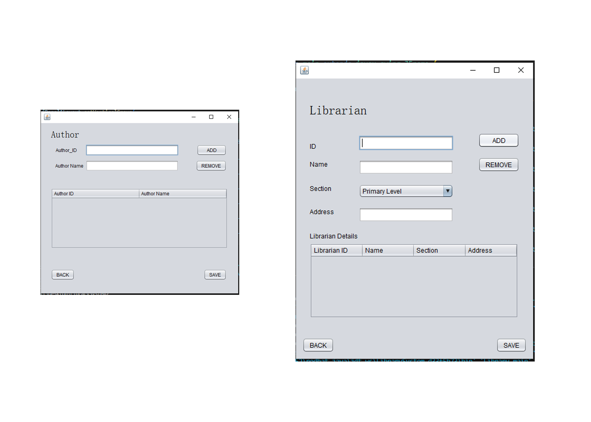
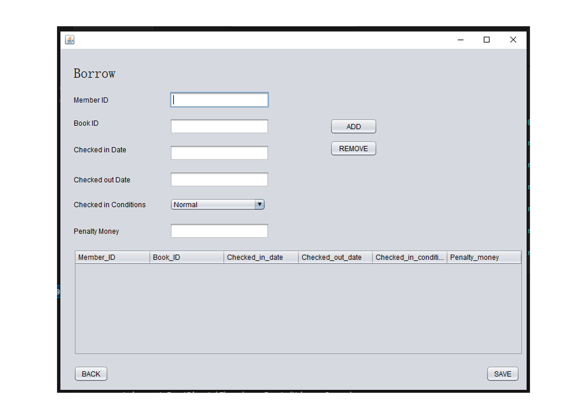

# 
Library-Management-System

This project implements a library management system using Java and JQuarry, providing features for librarians and students to manage library resources effectively.

# <h3>Key Functionalities:</h3>

- Librarian Management

  - Login Interface: Secure authentication for librarians using credentials. 
  - Add/Remove Librarian: Manage librarian accounts for system access.

- Student Management

  - Login Interface: Students can log in with their unique IDs for borrowing and returning books. 
  - Add/Remove Student: Register new students and update student records as needed.

- Book Management

  - Add New Book: Librarians can add book details (title, author, ISBN, etc.) to the library database. 
  - Borrow/Return Book: Students can search for books, borrow available titles, and return borrowed books with updates reflected in the database. 
  - Real-Time Table Updates: Changes made by librarians and students (adding new books, borrowing/returning) are dynamically reflected in a table for enhanced data visibility.

# Example: Adding a New Student (Real-Time Update)

1. Librarian Interface: The librarian logs in and navigates to the student management section.
2. Student Registration: A form appears for entering student details (name, ID, contact information).
3. Data Submission: Upon submission, the Java code processes the data.
4. Database Update: The student data is sent to the database (potentially using JDBC connection) for permanent storage.
5. update the student table displayed to the librarian. The table would then show the newly added student information in real-time.

# <h3>Sample Preview</h3>

# <h4> Home Page Interface</h4>

# <h4> Author Registration and Librarian Interface </h4>

# <h4> Borrower Interface</h4>

